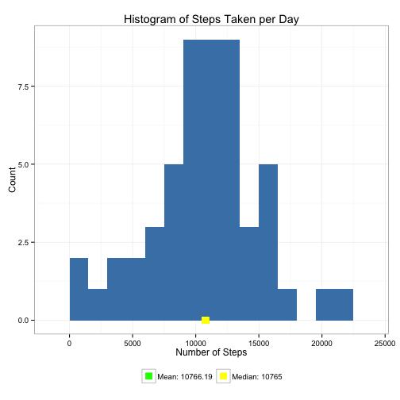
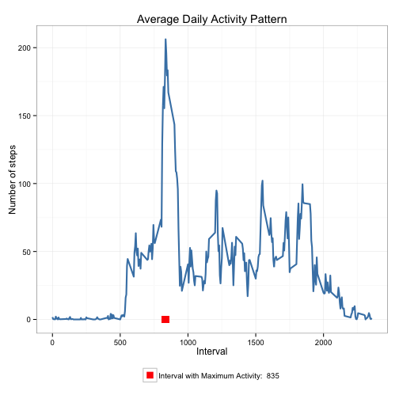

# Reproducible Research: Peer Assessment 1

This assignment makes use of data from a personal activity monitoring device. This device collects data at 5 minute intervals through out the day. The data consists of two months of data from an anonymous individual collected during the months of October and November, 2012 and include the number of steps taken in 5 minute intervals each day.

## Loading and preprocessing the data

1. The data file is downloaded if it is not present
2. It is uncompressed and read as a data frame.
3. The interval column is converted to factor type.
4. The date column is converted to Date type.
5. The data is examined by using summary and str methods on it.


```r
library(ggplot2)  # we shall use ggplot2 for plotting figures

# download and read the data, convert columns for convenience
read_data <- function() {
    fname = "activity.zip"
    source_url = "https://d396qusza40orc.cloudfront.net/repdata%2Fdata%2Factivity.zip"
    if (!file.exists(fname)) {
        download.file(source_url, destfile = fname, method = "curl")
    }
    con <- unz(fname, "activity.csv")
    tbl <- read.csv(con, header = T, colClasses = c("numeric", "character", 
        "numeric"))
    tbl$interval <- factor(tbl$interval)
    tbl$date <- as.Date(tbl$date, format = "%Y-%m-%d")
    tbl
}
tbl <- read_data()
```


Examine data.

```r
summary(tbl)
```

```
##      steps            date               interval    
##  Min.   :  0.0   Min.   :2012-10-01   0      :   61  
##  1st Qu.:  0.0   1st Qu.:2012-10-16   5      :   61  
##  Median :  0.0   Median :2012-10-31   10     :   61  
##  Mean   : 37.4   Mean   :2012-10-31   15     :   61  
##  3rd Qu.: 12.0   3rd Qu.:2012-11-15   20     :   61  
##  Max.   :806.0   Max.   :2012-11-30   25     :   61  
##  NA's   :2304                         (Other):17202
```

```r
str(tbl)
```

```
## 'data.frame':	17568 obs. of  3 variables:
##  $ steps   : num  NA NA NA NA NA NA NA NA NA NA ...
##  $ date    : Date, format: "2012-10-01" "2012-10-01" ...
##  $ interval: Factor w/ 288 levels "0","5","10","15",..: 1 2 3 4 5 6 7 8 9 10 ...
```


## What is mean total number of steps taken per day?

Below is a histogram of the daily total number of steps taken, plotted with a bin interval of 1500 steps. Also marked on the plot are the mean and median of the daily total steps.


```r
calc_steps_per_day <- function(tbl) {
    steps_per_day <- aggregate(steps ~ date, tbl, sum)
    colnames(steps_per_day) <- c("date", "steps")
    steps_per_day
}

plot_steps_per_day <- function(steps_per_day, mean_steps, median_steps) {
    col_labels = c(paste("Mean:", mean_steps), paste("Median:", median_steps))
    cols = c("green", "yellow")
    
    ggplot(steps_per_day, aes(x = steps)) + geom_histogram(fill = "steelblue", 
        binwidth = 1500) + geom_point(aes(x = mean_steps, y = 0, color = "green"), 
        size = 4, shape = 15) + geom_point(aes(x = median_steps, y = 0, color = "yellow"), 
        size = 4, shape = 15) + scale_color_manual(name = element_blank(), labels = col_labels, 
        values = cols) + labs(title = "Histogram of Steps Taken per Day", x = "Number of Steps", 
        y = "Count") + theme_bw() + theme(legend.position = "bottom")
}

steps_per_day <- calc_steps_per_day(tbl)
mean_steps = round(mean(steps_per_day$steps), 2)
median_steps = round(median(steps_per_day$steps), 2)
plot_steps_per_day(steps_per_day, mean_steps, median_steps)
```

 


**For the total number of steps taken per day:**  
- **Mean: 10766.19**
- **Median: 10765**


## What is the average daily activity pattern?

Below is a plot of the average daily pattern of the number of steps plotted against the interval number. The interval that clocks the maximum number of steps on the average is also marked.


```r
calc_steps_per_interval <- function(tbl) {
    steps_pi <- aggregate(tbl$steps, by = list(interval = tbl$interval), FUN = mean, 
        na.rm = T)
    # convert to integers for plotting
    steps_pi$interval <- as.integer(levels(steps_pi$interval)[steps_pi$interval])
    colnames(steps_pi) <- c("interval", "steps")
    steps_pi
}

plot_activity_pattern <- function(steps_per_interval, max_step_interval) {
    col_labels = c(paste("Interval with Maximum Activity: ", max_step_interval))
    cols = c("red")
    
    ggplot(steps_per_interval, aes(x = interval, y = steps)) + geom_line(color = "steelblue", 
        size = 1) + geom_point(aes(x = max_step_interval, y = 0, color = "red"), 
        size = 4, shape = 15) + scale_color_manual(name = element_blank(), labels = col_labels, 
        values = cols) + labs(title = "Average Daily Activity Pattern", x = "Interval", 
        y = "Number of steps") + theme_bw() + theme(legend.position = "bottom")
}

steps_per_interval <- calc_steps_per_interval(tbl)
max_step_interval <- steps_per_interval[which.max(steps_per_interval$steps), 
    ]$interval

plot_activity_pattern(steps_per_interval, max_step_interval)
```

 


The **835<sup>th</sup> interval** has the maximum activity on the average.

## Imputing missing values

To populate missing values, we choose to replace them with the mean value at the same interval across days. The choice is based on the assumption that activities usually follow a daily pattern.


```r
impute_means <- function(tbl, defaults) {
    na_indices <- which(is.na(tbl$steps))
    defaults <- steps_per_interval
    na_replacements <- unlist(lapply(na_indices, FUN = function(idx) {
        interval = tbl[idx, ]$interval
        defaults[defaults$interval == interval, ]$steps
    }))
    imp_steps <- tbl$steps
    imp_steps[na_indices] <- na_replacements
    imp_steps
}
complete_tbl <- data.frame(steps = impute_means(tbl, steps_per_interval), date = tbl$date, 
    interval = tbl$interval)
```


Summarizing the new dataset with imputed values:

```r
summary(complete_tbl)
```

```
##      steps            date               interval    
##  Min.   :  0.0   Min.   :2012-10-01   0      :   61  
##  1st Qu.:  0.0   1st Qu.:2012-10-16   5      :   61  
##  Median :  0.0   Median :2012-10-31   10     :   61  
##  Mean   : 37.4   Mean   :2012-10-31   15     :   61  
##  3rd Qu.: 27.0   3rd Qu.:2012-11-15   20     :   61  
##  Max.   :806.0   Max.   :2012-11-30   25     :   61  
##                                       (Other):17202
```


With the imputed dataset, below is a histogram of the daily total number of steps taken, plotted with a bin interval of 1500 steps. Also marked on the plot are the mean and median of the daily total steps.


```r
complete_steps_per_day <- calc_steps_per_day(complete_tbl)
complete_mean_steps = round(mean(complete_steps_per_day$steps), 2)
complete_median_steps = round(median(complete_steps_per_day$steps), 2)
plot_steps_per_day(complete_steps_per_day, complete_mean_steps, complete_median_steps)
```

 


Comparing with the calculations done in the first section of this document, we observe that while the mean value remains unchanghed, the median value has shifted closer to the mean.

## Are there differences in activity patterns between weekdays and weekends?

We do this comparison with the table with filled-in missing values.

1. Augment the table with a column that indicates the day of the week
2. Subset the table into two parts - weekends (Saturday and Sunday) and weekdays (Monday through Friday).
3. Tabulate the average steps per interval for each dataset.
4. Plot the two datasets side by side for comparison.


```r
calc_day_of_week_data <- function(tbl) {
    tbl$weekday <- as.factor(weekdays(tbl$date))
    weekend_data <- subset(tbl, weekday %in% c("Saturday", "Sunday"))
    weekday_data <- subset(tbl, !weekday %in% c("Saturday", "Sunday"))
    
    weekend_spi <- calc_steps_per_interval(weekend_data)
    weekday_spi <- calc_steps_per_interval(weekday_data)
    
    weekend_spi$dayofweek <- rep("weekend", nrow(weekend_spi))
    weekday_spi$dayofweek <- rep("weekday", nrow(weekday_spi))
    
    day_of_week_data <- rbind(weekend_spi, weekday_spi)
    day_of_week_data$dayofweek <- as.factor(day_of_week_data$dayofweek)
    day_of_week_data
}
plot_day_of_week_comparison <- function(dow_data) {
    ggplot(dow_data, aes(x = interval, y = steps)) + geom_line(color = "steelblue", 
        size = 1) + facet_wrap(~dayofweek, nrow = 2, ncol = 1) + labs(x = "Interval", 
        y = "Number of steps") + theme_bw()
}
day_of_week_data <- calc_day_of_week_data(complete_tbl)
plot_day_of_week_comparison(day_of_week_data)
```

 


We observe that activity on the weekends tends to be more spread out over the day compared to the weekdays. This could be due to the fact that activities on weekdays mostly follow a work related routine, whereas weekends tend to be more adhoc.


